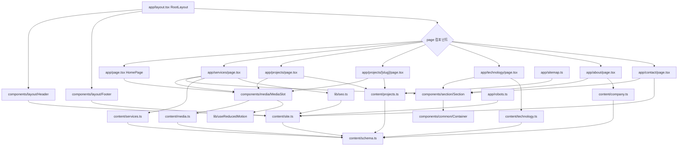

# 코드 인벤토리 — Phase 1 (2026-08-13)

> 양식 권위: `docs/claude_guideline/code_review/review.md` Core 인벤토리
> 용도: coding SOP §2(사전조사) 가 다음 세션에서 읽는 표. §6(후속갱신)이 이 파일을 덮어쓴다.
> 범위: `src/` 전체 (Phase 1 시점)

---

## 1. 목적

`src/` 는 Physical AI 엔지니어링 스튜디오 홈페이지의 프론트엔드 전체다. Next.js App Router 기반이며 정적 export 로 빌드된다(ADR-0002).

구조는 세 층으로 나뉜다.

- **콘텐츠 층(`content/`)** — 사이트의 모든 문구·데이터. zod 스키마로 빌드 타임 검증된다. 컴포넌트는 문자열을 직접 갖지 않는다(ADR-0003).
- **표현 층(`components/`, `app/`)** — 콘텐츠를 받아 렌더한다. 레이아웃·타이포 스케일은 `Section`/`SectionHeading`/`Container` 에 모여 있다.
- **보조 층(`lib/`, `styles/`)** — 메타데이터 생성, 브라우저 설정 구독, 디자인 토큰.

미디어 자산은 `content/media.ts` 매니페스트를 통해서만 주입되며, `MediaSlot` 하나가 (영상 → 포스터 → 플레이스홀더) 폴백을 담당한다(ADR-0005).

---

## 2. 코드 플로우 (모듈 간 호출 관계)

> `.drawio` 동반본은 아직 만들지 않았다. code_review SOP 는 **리뷰 산출물**에 drawio 를 의무화하며, 본 파일은 coding SOP §6 의 인벤토리다. 정식 코드 리뷰 수행 시 함께 생성한다.

---

## 3. 함수 리스트 표

| #   | 함수                   | 입력                                  | 출력                    | 기능                                                           | 위치(file:line)                            |
| --- | ---------------------- | ------------------------------------- | ----------------------- | -------------------------------------------------------------- | ------------------------------------------ |
| 1   | `getMediaAsset`        | `slotId: string`                      | `MediaAsset`            | 슬롯 ID 로 자산 조회. 미등록 슬롯은 플레이스홀더로 폴백        | `content/media.ts:53`                      |
| 2   | `isPublishableAsset`   | `asset: MediaAsset`                   | `boolean`               | 공개 근거가 확인된 자산인지 판정                               | `content/media.ts:63`                      |
| 3   | `getVisibleProjects`   | 없음                                  | `Project[]`             | 노출 대상 프로젝트 목록. 프로덕션에서는 게시분만               | `content/projects.ts:61`                   |
| 4   | `findProjectBySlug`    | `slug: string`                        | `Project \| undefined`  | 슬러그로 프로젝트 1건 조회                                     | `content/projects.ts:69`                   |
| 5   | `buildPageMetadata`    | `{ title, description?, path }`       | `Metadata`              | 페이지 메타데이터 생성(제목·설명·canonical·OG)                 | `lib/seo.ts:16`                            |
| 6   | `subscribe`            | `onStoreChange: () => void`           | `() => void`            | 모션 축소 미디어 쿼리 변경 구독(외부 스토어)                   | `lib/useReducedMotion.ts:7`                |
| 7   | `getSnapshot`          | 없음                                  | `boolean`               | 현재 모션 축소 설정 값                                         | `lib/useReducedMotion.ts:13`               |
| 8   | `getServerSnapshot`    | 없음                                  | `boolean`               | 서버 렌더 시 기본값(`false`)                                   | `lib/useReducedMotion.ts:18`               |
| 9   | `useReducedMotion`     | 없음                                  | `boolean`               | 모션 축소 설정 구독 훅                                         | `lib/useReducedMotion.ts:28`               |
| 10  | `Container`            | `{ children, wide?, className? }`     | `JSX`                   | 좌우 여백·최대 폭 단일 관리                                    | `components/common/Container.tsx:11`       |
| 11  | `ButtonLink`           | `{ href, children, variant? }`        | `JSX`                   | 테두리형 링크 버튼(hover 시 채움)                              | `components/common/Button.tsx:17`          |
| 12  | `Reveal`               | `{ children, delayMs?, className? }`  | `JSX`                   | 스크롤 진입 시 1회 페이드 인. 모션 축소 시 즉시 표시           | `components/common/Reveal.tsx:21`          |
| 13  | `MediaSlot`            | `{ slotId, className? }`              | `JSX`                   | 영상 → 포스터 → 플레이스홀더 3단 폴백                          | `components/media/MediaSlot.tsx:24`        |
| 13a | `MediaCredit`          | `{ credit }`                          | `JSX`                   | 제3자 자산의 권리자·라이선스 출처 표기(우하단 링크)            | `components/media/MediaSlot.tsx:89`        |
| 14  | `Section`              | `{ children, id?, fullHeight?, ... }` | `JSX`                   | 섹션 세로 리듬·전체 높이·구분선                                | `components/section/Section.tsx:15`        |
| 15  | `SectionHeading`       | `{ eyebrow?, title, body?, as? }`     | `JSX`                   | 섹션 제목 블록. 타이포 스케일 단일 정의                        | `components/section/SectionHeading.tsx:11` |
| 15a | `GateList`             | `{ gates, className? }`               | `JSX`                   | HOW WE WORK 다섯 문 목록. 홈·About 공용 (ADR-0009)             | `components/section/GateList.tsx:17`       |
| 16  | `Header`               | 없음                                  | `JSX`                   | 고정 헤더(항상 불투명 검정) + 모바일 메뉴                      | `components/layout/Header.tsx:14`          |
| 17  | `Footer`               | 없음                                  | `JSX`                   | 푸터(브랜드·메뉴·연락처)                                       | `components/layout/Footer.tsx:5`           |
| 18  | `RootLayout`           | `{ children }`                        | `JSX`                   | 루트 레이아웃. 본문 바로가기·헤더·푸터 배치                    | `app/layout.tsx:25`                        |
| 19  | `HomePage`             | 없음                                  | `JSX`                   | 홈 조립 — Hero + 7개 섹션. 게시 프로젝트 0건이면 Projects 생략 | `app/page.tsx:22`                          |
| 19a | `HeroSection`          | 없음                                  | `JSX`                   | 전체 화면 Hero(비주얼 + 스크림 3겹 + 카피 + CTA)               | `app/page.tsx:40`                          |
| 19b | `ProblemsSection`      | 없음                                  | `JSX`                   | 01 — 고객이 가지고 오는 질문 목록                              | `app/page.tsx:86`                          |
| 19c | `ServicesSection`      | 없음                                  | `JSX`                   | 02 — 서비스 5종 요약 행, 상세로 링크                           | `app/page.tsx:114`                         |
| 19d | `HowWeWorkSection`     | 없음                                  | `JSX`                   | 03 — 다섯 문 (ADR-0009). 운영 루프는 /technology 로 이관       | `app/page.tsx:154`                         |
| 19e | `ProjectsSection`      | 없음                                  | `JSX`                   | 04 — 케이스 스터디 최대 4건 그리드                             | `app/page.tsx:170`                         |
| 19f | `TechnologySection`    | 없음                                  | `JSX`                   | 05 — 기술 그룹 4열 요약                                        | `app/page.tsx:206`                         |
| 19g | `WhySection`           | 없음                                  | `JSX`                   | 06 — 비주얼 + 문구 (목록 없음, ADR-0009)                       | `app/page.tsx:245`                         |
| 19h | `ContactSection`       | 없음                                  | `JSX`                   | 07 — 전체 화면 문의 CTA                                        | `app/page.tsx:259`                         |
| 20  | `ServicesPage`         | 없음                                  | `JSX`                   | 서비스 5종 섹션 나열                                           | `app/services/page.tsx:14`                 |
| 21  | `ProjectsPage`         | 없음                                  | `JSX`                   | 케이스 스터디 목록. 게시분 0건이면 빈 상태 안내                | `app/projects/page.tsx:14`                 |
| 22  | `generateStaticParams` | 없음                                  | `{ slug }[]`            | 정적 export 대상 프로젝트 경로 나열                            | `app/projects/[slug]/page.tsx:18`          |
| 23  | `generateMetadata`     | `{ params }`                          | `Promise<Metadata>`     | 프로젝트 상세 메타데이터. 미게시는 `noindex`                   | `app/projects/[slug]/page.tsx:26`          |
| 24  | `ProjectPage`          | `{ params }`                          | `Promise<JSX>`          | 케이스 스터디 5단 구조 렌더                                    | `app/projects/[slug]/page.tsx:43`          |
| 25  | `TechnologyPage`       | 없음                                  | `JSX`                   | 워크플로 5단계 + 기술 그룹별 역할                              | `app/technology/page.tsx:13`               |
| 26  | `AboutPage`            | 없음                                  | `JSX`                   | Philosophy → Principles → Founder                              | `app/about/page.tsx:12`                    |
| 27  | `ContactPage`          | 없음                                  | `JSX`                   | 문의 진입 화면(현재 이메일 경로만)                             | `app/contact/page.tsx:18`                  |
| 28  | `NotFound`             | 없음                                  | `JSX`                   | 404 페이지                                                     | `app/not-found.tsx:4`                      |
| 29  | `sitemap`              | 없음                                  | `MetadataRoute.Sitemap` | 사이트맵 생성. 미게시 프로젝트 제외                            | `app/sitemap.ts:11`                        |
| 30  | `robots`               | 없음                                  | `MetadataRoute.Robots`  | robots.txt 생성                                                | `app/robots.ts:7`                          |

중복·유사 함수: **없음** (`dup-signature.sh src` 통과).

---

## 4. 전역 변수 / 모듈 상수 표

가변 전역 상태는 **없다.** 모든 모듈 레벨 값은 상수이며, 상태는 컴포넌트 지역(`useState`/`useSyncExternalStore`)에만 존재한다.

| #   | 사용처(함수)                                       | 기능                                                                        | 위치(file:line)                                                                  |
| --- | -------------------------------------------------- | --------------------------------------------------------------------------- | -------------------------------------------------------------------------------- |
| 1   | 전 콘텐츠 모듈 (상수)                              | zod 스키마 정의 15종(`creditSchema` · `homeSchema` 포함)                    | `content/schema.ts:14~210`                                                       |
| 2   | `Header` · `Footer` · `ContactPage` · `seo` (상수) | `site` — 브랜드·내비게이션·CTA·연락처                                       | `content/site.ts:9`                                                              |
| 3   | `ServicesPage` (상수)                              | `services` — 서비스 5종                                                     | `content/services.ts:7`                                                          |
| 4   | `getVisibleProjects` · `findProjectBySlug` (상수)  | `allProjects` — 케이스 스터디 목록                                          | `content/projects.ts:53`                                                         |
| 5   | `TechnologyPage` (상수)                            | `technologyGroups`, `workflowSteps`                                         | `content/technology.ts:7`, `:51`                                                 |
| 6   | `AboutPage` · `WhySection` (상수)                  | `company` — 철학·원칙·창업자                                                | `content/company.ts:7`                                                           |
| 6a  | 홈 전 섹션 (상수)                                  | `home` — Hero 카피 + 7개 섹션 문구                                          | `content/home.ts:10`                                                             |
| 6b  | `ServicesPage` (상수)                              | `capabilityGroups` — 검증 항목 5분류                                        | `content/capabilities.ts:11`                                                     |
| 7   | `getMediaAsset` (상수)                             | `mediaManifest` — 슬롯 ID → 자산                                            | `content/media.ts:13`                                                            |
| 8   | `useReducedMotion` 계열 (상수)                     | `REDUCED_MOTION_QUERY` — 미디어 쿼리 문자열                                 | `lib/useReducedMotion.ts:5`                                                      |
| 9   | `Reveal` (상수)                                    | `VISIBILITY_THRESHOLD` — 리빌 발동 가시 비율 0.15                           | `components/common/Reveal.tsx:13`                                                |
| 11  | `sitemap` (상수)                                   | `STATIC_PATHS` — 정적 라우트 목록                                           | `app/sitemap.ts:9`                                                               |
| 12  | Next.js 규약 (상수)                                | `dynamic = "force-static"`, `dynamicParams = false`, `metadata`, `viewport` | `app/sitemap.ts:6`, `app/robots.ts:5`, `app/projects/[slug]/page.tsx:9`, 각 page |

**필요성 평가**: 1~~7 은 콘텐츠 데이터로, 컴포넌트에서 분리하는 것이 ADR-0003 의 목적이므로 모듈 레벨이 적절하다. 8~~11 은 매직 넘버를 명명 상수로 올린 것이라 유지한다. 12 는 프레임워크 규약이라 대체 불가.

---

## 5. 의존성 3-tier 표

| Tier        | 대상                                   | 버전/제약   | 부재 시 동작                                        | 근거(파일:line)              |
| ----------- | -------------------------------------- | ----------- | --------------------------------------------------- | ---------------------------- |
| 빌드        | `next`                                 | 16.3.0      | 빌드 불가                                           | `package.json:19`            |
| 빌드        | `react` / `react-dom`                  | 19.2.8      | 빌드 불가                                           | `package.json:20-21`         |
| 빌드        | `zod`                                  | ^4.4.3      | 콘텐츠 검증 불가 — 빌드 불가                        | `package.json:22`            |
| 빌드        | `tailwindcss` + `@tailwindcss/postcss` | ^4          | 스타일 미적용                                       | `package.json:25,33`         |
| 빌드        | `typescript`                           | ^5          | 타입 검사 불가                                      | `package.json:34`            |
| 빌드        | `eslint`, `eslint-config-next`         | ^9 / 16.3.0 | 정적 분석 생략                                      | `package.json:29-30`         |
| 빌드        | `prettier`                             | ^3.9.6      | 포맷 검사 생략                                      | `package.json:31`            |
| 빌드        | `vitest`                               | ^4.1.10     | 회귀 테스트 생략                                    | `package.json:35`            |
| 런타임 필수 | 브라우저 (ES2017+)                     | —           | 페이지 렌더 불가                                    | `tsconfig.json:3`            |
| 런타임 선택 | 외부 미디어 스토리지/CDN               | 미정        | **fallback**: 자산 미등록 시 플레이스홀더 렌더      | `content/media.ts:13`        |
| 런타임 선택 | `matchMedia`                           | —           | **fallback**: 서버 스냅샷 `false`(모션 허용)로 동작 | `lib/useReducedMotion.ts:18` |

정적 export 산출물이므로 **런타임 서버 의존성은 없다.**
